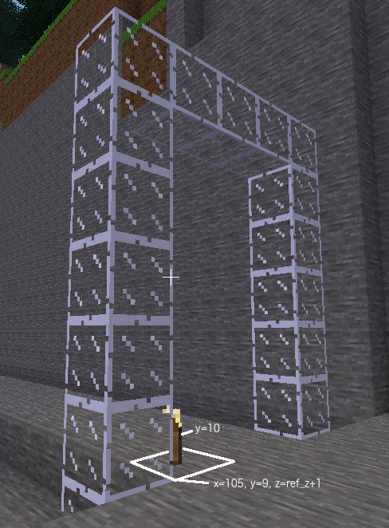

# Arch floor
The single arch is almost complete.

## Task
Fix the floor under the arch by changing it from glass to stone.

Place a torch on the floor at `(ref_z + 1)`

## Lesson
In this task you will need to enter the complete `build` command.
The `build` command is called from a `MinetestConnection` object. If your
`MinetestConnection` object is stored in a variable called `mc` then
`build` can be called from `mc`.

    mc.build(x, y, z, item)

where x, y and z are the coordinates of the location to build the item. They can each be single
numbers or sequences of numbers. The item is a str or dict describing the block properties.
(More on dicts later).

 

Store in variable floor the name the material for floor of arch

The second answer requires the full <code>mc.build()</code> to change the three blocks at the base of the arch to stone

The second answer can use the variables range_x_arch, floor_y, range_z_int, floor

The third answer requires the full <code>mc.build()</code> command to place a torch at <code>range_x_arch, floor_y + 1, player_z + 1</code>

 
