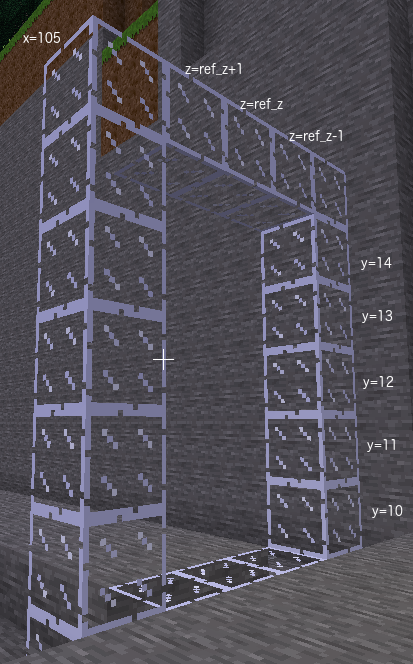

# Task 10 - Arch - hollow
That wall doesn't look like an arch!

## Task
Remove the centre part of the
wall so it becomes an arch. Remember for the `range_y_int`
and `range_z_int` you can use a list
of numbers or a formula.

        range_y_int = [10, 11, 12, 13, 14]

or

        range_y_int = range(floor_y + 1, floor_y + arch_height - 1)

## Lesson
To remove blocks we replace them with `"air"`.

In your program, the external dimensions are for
the glass blocks on the outside of the arch `range_y_ext, range_z_ext`.
The internal dimensions are for the air blocks on the
inside of the arch `range_y_int, range_z_int`.

 

range_y_int is a formula or list of numbers for all y values on the inside of the arch which should be air

For range_y_int use the range() function to return a sequence of numbers from one above the floor to one below the ceiling

range_z_int is a formula or list of numbers for all z values which should be air on the inside of the arch

For range_z_int use the range() function to return a sequence of numbers from one block inside the right wall to one block inside the left wall

The third answer requires you to type the full <code>mc.build()</code> statement to replace inside of arch with air

Use variables range_x_arch, range_y_int, range_z_int and air as parameters for <code>mc.build()</code>

The final answer to be typed in is <code>mc.build(range_x_arch, range_y_int, range_z_int, air)</code>.

© Copyright 2018-2021 Triptera Pty Ltd - https://pythonator.com - See LICENSE.txt
