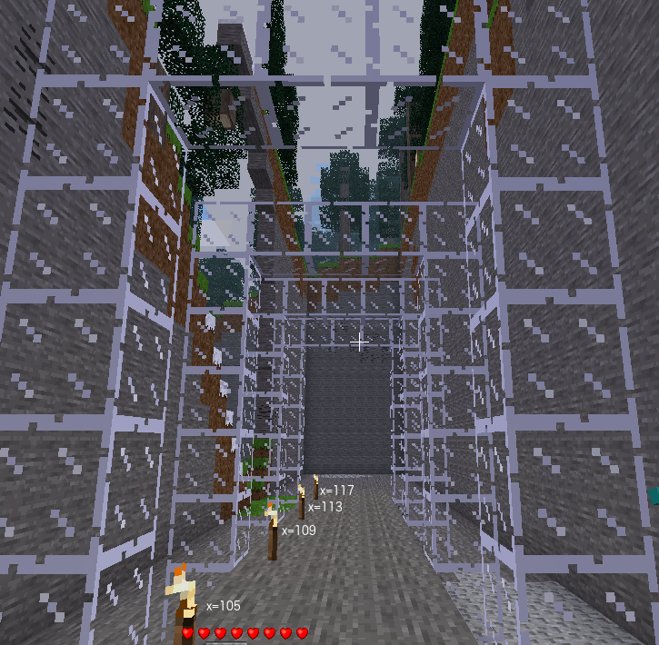

# Arches
Now that you have built one arch it is easy to build several arches.

## Task
Change the value of `range_x_arch` to be a sequence of four x values where
each arch is separated by three blocks. ie the values are counting up in fours.

 

Change the value in one variable to build four arches instead of one arch

<code>range_x_arch</code> needs to be the list of numbers or formula to return a sequence of four x values, every 4 blocks starting at path_x_min

<code>[105, 109, 113, 117]</code> 
 
is one answer

<code>range(path_x_min, path_xmin + path_length, 4)</code> 
 
is another answer

 
