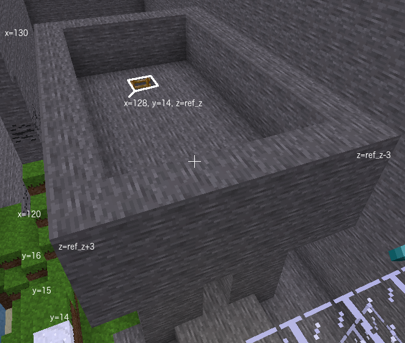
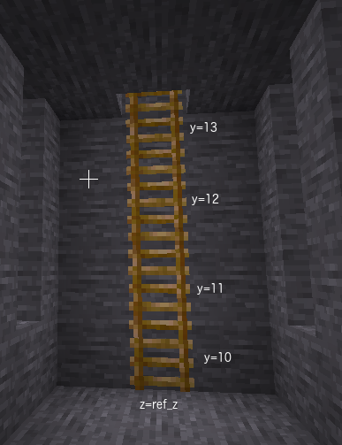

# Castle roof
The castle roof sits on top of the castle base. It is a similar shape to the castle base,
an open box without a top, but it extends on block on every side in the x and z directions
and is only three blocks high.

## Task
Add a 11 x 7 x 3 open top stone box on top of the castle base to be the roof.

Add a ladder so that players can climb up the ladder to the roof. Ladder
needs a direction so that its orientation is known and in which part of the cube of space the
ladder should be placed. See the hints for more details.

 

When setting the "direction" of the ladder use  
<code>"+x"</code> player looking towards higher values of x when climbing ladder 
<code>"-x"</code> player looking towards lower values of x when climbing ladder

<code>range_x_roof_ext</code> needs to be the numbers or formula returning x values for blocks in roof. Roof extends one extra block on all sides of castle base.

<code>range_x_roof_ext</code> can be   
<code>[120, 121, 122, 123, 124, 125, 126, 127, 128, 129, 130]</code>  or 
<code>range(120, 131)</code>  or 
<code>range(castle_x_min - 1, castle_x_min + castle_length + 1)</code>

<code>range_y_roof_ext</code> needs to be the y values for roof. Roof starts at <code>floor_y + castle_height</code> and is 3 blocks high.

<code>range_z_roof_ext</code> needs to be the z values of roof

roof extends over side walls of castle by one block either side

When building the roof for the castle use the same building material as castle walls

When building the internal part of the castle roof use the building material which removes blocks so that players can walk around on roof

The building material "air" removes blocks. It is the only building material which does not contain a colon ":".

When building the ladder you need to provide the y values of ladder

The ladder starts from the block above the floor

Height of ladder is same as height of castle base. It starts one block higher and finishes one block higher

The y values for the ladder can be   
<code>[10, 11, 12, 13, 14]</code> or 
<code>range(10, 15)</code> or 
<code>range(floor_y + 1, floor_y + 1 + castle_height)<code/>

 
