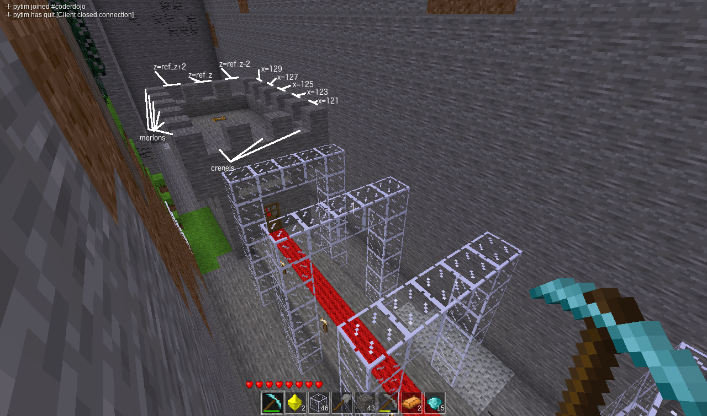
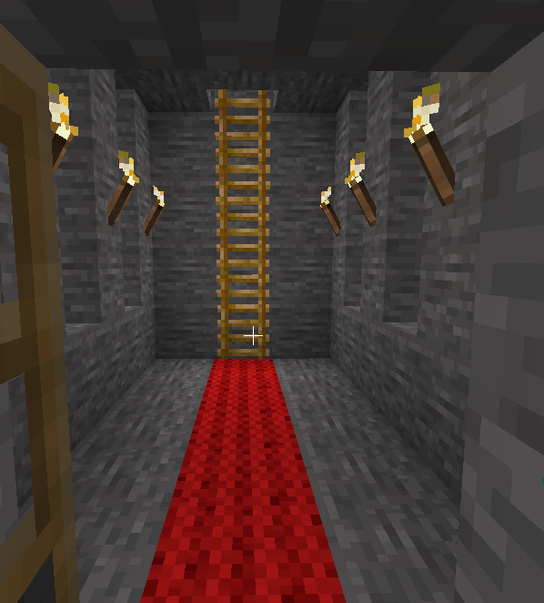

# Castle

## Task
To finish off the castle, add a door at the entrance, crenels on the roof
and red carpet under the arches, through the door and to the ladder.

## Door
Only the bottom half of a door needs to be placed and the top half will automatically
appear. It is important therefore to ensure top space for door is air. Otherwise the door
will not be able to move.

The name for a wooden door is `"doors:door_wood_a"`.
The `"_a"` at the end means the left door of a pair. If the door ended in
`"_b"` it would be the right door.

Doors also need a "direction" parameter. The direction is the direction the player is
facing when viewing the door. When a player is viewing the door in that direction the 
door will be flush with any wall beside it. Possible directions are 
`"+x", "-x", "+z", "-z"`. Experiment with different values to find the door direction
you like the best.

## Crenels and Merlons
The classic castle design has a square tooth wall protecting soldiers in the castle. The gaps
between the teeth are called crenels and the soldiers can shoot arrows or fling other
projectiles through them. The teeth are called merlons and they protect the soldiers from
the attackers. We currently have a solid wall so need to add crenels for soldiers to 
shoot arrows through. The crenels will be in every second position. We can't have a crenel 
in the corners because the merlons will obscure them.

See if you can use `range()` functions to place crenels every second block
on the walls of the roof.

## Carpet
Red wool will make a fitting carpet for your castle.

 

## Congratulations
When you have finished this task you have finished all the tasks in this course.

Well done!

 

Choose one of the wool colours for the carpet.

The full list of possible colours is white|grey|dark_grey|black|blue|cyan|green|dark_green|yellow|orange|brown|red|pink|magenta|violet

Provide the <code>dict</code> which specifies a wooden door

The <code>dict</code> for the wooden door needs two keys, "name" and "direction"

The value of key "name" for the wooden door needs the to be the item name of wooden door

The value of key "direction" for the wooden door needs to be "+x" or "+z" or "-x" or "-z"

The full <code>dict</code> for the wooden door is <code>{"name": "doors:door_wood_a", "direction": "+x"}</code>

<code>crenel_y</code> needs to be the y value where crenels will be created in wall

<code>crenel_y</code> can be a number or a formula

<code>crenel_y</code> formula can be written in terms of <code>floor_y</code> and <code>castle_height</code>

<code>crenel_y</code> can be   
<code>16</code>  or  
<code>floor_y + castle_height + 2</code>

<code>roof_x1</code> needs to be the number or formula for x value at minimum x end of roof

<code>roof_x1</code> formula can be written in terms of castle_x_min

<code>roof_x1</code> should be one block earlier than castle_x_min

<code>roof_x1</code> can be   
<code>120</code>  or  
<code>castle_x_min - 1</code>

<code>roof_z1</code> needs to be the minimum z value of wall for building crenels

<code>roof_z1</code> needs to be one less than wall_z1

<code>roof_z1</code> can be number or formula

<code>roof_z2</code> needs to be one more than wall_z2

When building crenels at each end of the roof you need to provide the two x values corresponding to the ends of the roof

When laying the red carpet you need to provide the sequence of all the x values where carpet is to be laid

Carpet starts at <code>path_x_min</code>

Last x value for carpet is same as last x value in <code>range_x_castle_int</code>

Carpet x values can be   
<code>range(105, 129)</code> 
 
or 
 
<code>range(path_x_min, castle_x_min + castle_length - 1)</code> 
 
or 
 
a list of numbers!

 
