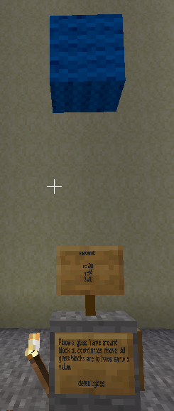

# Task 1b - Placing a block using variables
This is a repeat of Minetest Task 1 using variables instead of numbers. Fill in the rectangles
in the program task.py on the left. Use hints to find out exactly what needs to be done.
Ctrl-shift-F10 to run the program. "Check" button below to check it is completed correctly.
After you have successfully completed this task, click the "Next" button to go to the next task.

## Task
Store coordinates of wool location in variables and then use variables in the build command to
place the wool.

## Lesson
Variables are memory to store data in a computer program.
They can store numbers or text or many other forms of data.
To store data in a variable, give it a name and put the data in it using an equals sign.

    my_variable = 100

The above line creates a new variable called `my_variable` and gives it the value 100.

Storing data in variables helps when you don't know the data when you are writing the program but will know it
when the program is run. For example the z value is different for every player. The program can be written before the
player is known and the z value can be filled later. The program on the left has a variable called `ref_z` which
stores the player's z value. It is called `ref_z` because all your building will use it as a reference coordinate
and you will build relative to it.

To use the data in a variable, type its variable name where you previously typed the data. For example, if your `ref_z` was 0:

    mc.build(100, 14, 0, "wool:blue")

becomes

    mc.build(ref_x, ref_y, ref_z, wool)

The first answer is a number and is the y coordinate from sign for position to place block

The second answer is a number and is the z coordinate from sign for position to place block

The third answer is the name of the variable containing the x value

© Copyright 2018-2021 Triptera Pty Ltd - https://pythonator.com - See LICENSE.txt
