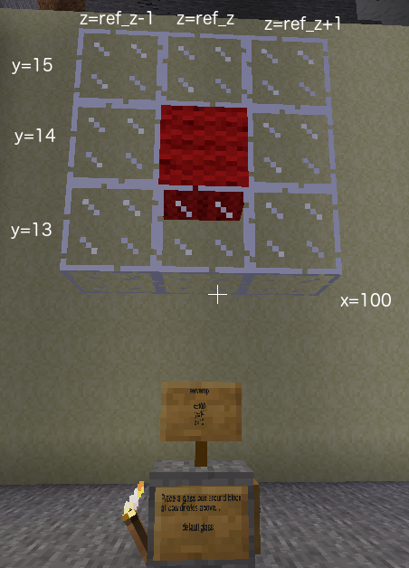

# Task 2 - Placing several blocks
This is the easy course. Whenever the task asks for variable names
or a formula, then it is also correct to just type in a number or list of numbers. The only
time this won't work is for variables in loops.

## Task
Find your sign in Minetest to find your second task. Then complete the program on the left
to satisfy the task.

## Lesson
A program starts at the top and runs each line in order. If you want to place
several blocks, create a new `build` command for each block. When you have finished
all the `build` commands, run the `send_building` command to
send all the blocks you have built to Minetest. If two of the `build` commands
have the same x, y, z coordinates, the second will replace the previous block before it even gets sent
to Minetest.

 

ref_z should be set to the value of z on your sign in Minetest.

The second <code>build</code> command needs an x value. It is the same x value used in every other <code>build</code> command on this task

The fifth <code>build</code> command needs a z value for the centre wool block. You can enter a number or the name of the variable containing that number.

The ninth <code>build</code> command needs the z value for the top right glass block.
Enter the number or a formula which equals that z value.

© Copyright 2018-2021 Triptera Pty Ltd - https://pythonator.com - See LICENSE.txt
