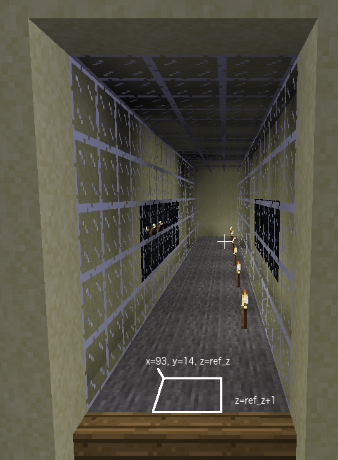

# Task 8 - Tunnel floor

Look in the tunnel you just built in the Minetest world to see Task 8.

## Task
Replace the floor of the tunnel with stone and place a torch every four blocks.
Think carefully when you are filling in your task.py program whether you need 
a single number or sequence of numbers for each answer.

## Lesson
Remember when using the `range()` function you can specify the step as
well as the start and stop values.

    range(start, stop, step)

The step value defaults to `1` if you don't include it, which is fine if you are
counting up in ones. However, if you are counting up in fours, include a step value of 4.
If you are counting down, make sure your step is negative.

        range(93, 70, -4)  # is equivalent to (93, 89, 85, 81, 77, 73)

 

range_x_torch is a sequence of x values for torch locations

replacing the floor with stone requires the same x values as the walls and air.

placing torches requires a number or formula for the y coordinate just above the floor of the tunnel

© Copyright 2018-2021 Triptera Pty Ltd - https://pythonator.com - See LICENSE.txt
