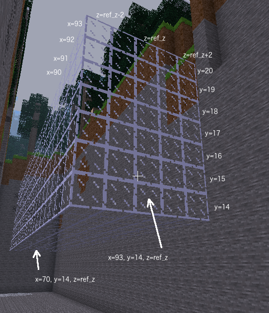
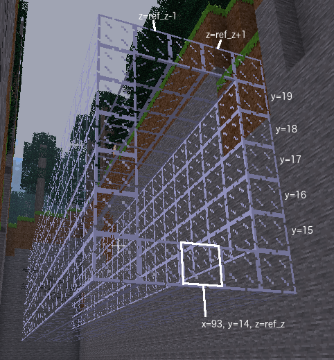

# Task 4 - Tunnel
Visit the Minetest world to find your next task. You will have to climb down a ladder to
find your next task on two signs.
In Minetest you descend ladders using the \<shift> key. To ascend, use \<space> key.

## Task
Build a tunnel by building a cuboid of glass and then building a cuboid of air in the centre.

## Lesson
Number sequences are used frequently so Python has a `range()` function which can
produce them easily. The `range()` function has up to three arguments, the start value,
the stop value and the step value. A trap for new coders with the `range()` function is it
counts up to but not including the stop value. This is actually useful because it means when
increment is 1 (the default) the stop value minus the start value is the length of the
sequence, and in our case that means the number of blocks placed.

The three forms of the `range()` function are:

        range(stop)
        range(start, stop)
        range(start, stop, step)

Examples

        range(3)          # equivalent to (0, 1, 2)
        range(2, 5)       # equivalent to (2, 3, 4)
        range(4, 0)       # equivalent to () because range() won't count backwards by default
        range(4, 0, -1)   # equivalent to (4, 3, 2, 1)
        range(70, 93, 4)  # equivalent to (70, 74, 78, 82, 86, 90)

Your task in Minetest will have a height, a width, x1, x2, y and z values.
These numbers will need to be assigned correctly to the variables
ref_z, x_max, x_min, floor_y, tunnel_height, tunnel_width.

In this task store sequences of numbers in range_y_ext and range_z_ext. Start with entering as
lists of numbers. If you feel confident, convert that list to use the `range()`
function. Once that works, try using variable names and formulae. They will be similar to
those used in range_x, range_y_int and range_z_int.

 

x_max is maximum value of x1 and x2

x_min is minimum value of x1 and x2

floor_y is y coordinate of floor of tunnel

tunnel_height is external height of tunnel in number of blocks

tunnel_width is external width of tunnel in number of blocks

range_y_ext is the external y values and is the sequence of y values for glass blocks in wall of tunnel

range_y_ext can be specified using one of the following:<ul>
<li>list of numbers</li>
<li>list of formulae based on variables</li>
<li>range using range() function</li> 

The <code>range(start, stop)</code> function
produces a sequence of consecutive numbers starting with <code>start</code> and 
stopping just before it gets to <code>stop</code>. It can be used for range_y_ext and range_z_ext.

You can define range_y_ext using <code>range(floor_y, floor_y + tunnel_height)</code>

range_z_ext is a sequence of z values starting at <code>wall_z</code> and stopping just before it gets to <code>wall_z + tunnel_width</code>

second parameter of the first build command needs variable containing the sequence of y values for the <b>external</b> glass of the tunnel

third parameter of the second build command needs variable containing the sequence of z values for the <b>internal</b> air

© Copyright 2018-2021 Triptera Pty Ltd - https://pythonator.com - See LICENSE.txt
