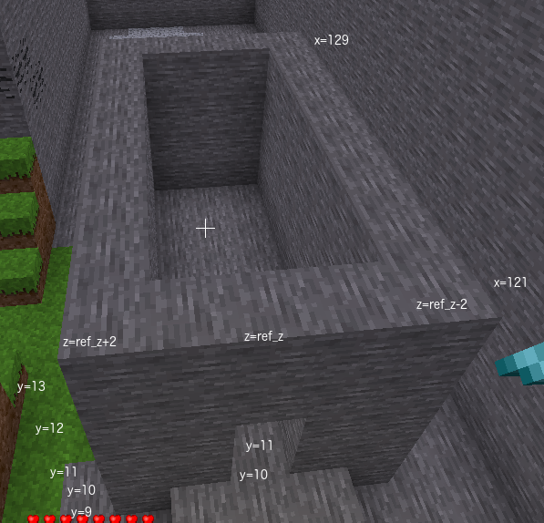

# Task 13 - Castle base
We are going to start by building the base of the castle.
The base will be a room with four walls and no roof. We can 
build this by building a cuboid of stone and then inside that
a cuboid of air. We will replace two blocks in the front wall
to make a doorway.

The base section of the castle will be 5 blocks high.
The length of the castle will be 9 blocks. The width of the 
castle will be 5 blocks.

## Task
Create a 9 x 5 x 5 open top stone box starting at x = 121, y = 9. Add a 2 x 1 doorway.

 

<code>castle_length</code> needs to be the length of castle as number of blocks at the base in the x direction

<code>castle_width</code> needs to be the width of castle as a number of blocks at the base in the z direction

<code>castle_height</code> needs to be the height of base of castle as a number of blocks including the floor but excluding the roof

<code>wall_z</code> needs to be the formula in terms of <code>ref_z</code> and <code>castle_width</code> to determine where to build the first wall. 

Castle <code>wall_z</code> is similar to formulae used for arch <code>wall_z</code> and tunnel <code>wall_z</code>

For arch we used

<code>wall_z = ref_z - arch_width // 2</code> 

<code>wall_z = ref_z - castle_width // 2</code>

<code>range_x_castle_ext</code> needs to be the sequence of numbers for all x values of stone to be placed at base of castle

<code>range_x_castle_ext</code> sequence should start at <code>castle_x_min = 121</code> 
 
and have <code>castle_length  = 9</code> blocks.

<code>range_x_castle_ext</code> can use a list of numbers or a formula using <code>range()</code> function

<code>range_x_castle_ext</code> can be   
<code>[121, 122, 123, 124, 125, 126, 127, 128, 129]</code> 
 
or 
 
<code>range(121, 130)</code> 
 
or 
 
<code>range(castle_x_min, castle_xmin + castle_length)</code>

<code>range_y_castle_ext</code> needs to be the sequence of numbers for all y values of stone in base of castle

<code>range_y_castle_ext</code> needs to include the stone on the floor of the castle at <code>floor_y = 9</code>

<code>range_y_castle_ext</code> can be   
<code>[9, 10, 11, 12, 13]</code> 
 
or 
 
<code>range(9, 14)</code> 
 
or 
 
<code>range(floor_y, floor_y + castle_height)</code>

<code>range_z_castle_ext</code> needs to be sequence of numbers for all z values of stone at base of castle

To build the doorway provide the sequence of y values to make a doorway in front wall of castle

Doorway is two blocks high so need two numbers

Doorway can be   
<code>[10, 11]</code> 
 
or 
 
<code>[floor_y + 1, floor_y + 2]</code>

© Copyright 2018-2021 Triptera Pty Ltd - https://pythonator.com - See LICENSE.txt
