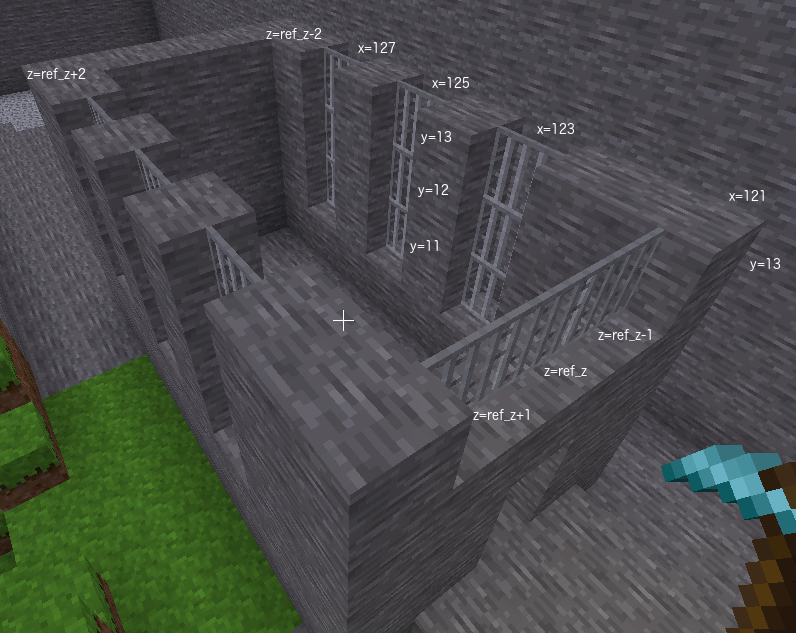

# Task 14 - Castle windows
Let us place some iron bar type windows on the front wall and side walls
    of the castle.

## Task
Place three windows on each side wall. The windows will
be 3 blocks high and one block wide and evenly spaced along the side
wall. They will not touch the floor but can go to the full height of
the castle base.

Place one window along the front wall. It will be three blocks wide
and one block high. It will be placed on the top row of blocks of the 
castle base.

## Lesson
We will use bars for our windows "xpanes:bar_flat".
The problem with bars is we have to specify a direction as well
as a the building material name.

Python has a dict type which means dictionary. A dict contains
multiple pieces of data in a single variable. We have also
seen lists store multiple pieces of data.

    my_list = [13, 14, 15]

The difference with dicts is they can give names to
each piece of data in the variable. The names are called keys
and you use the key to specify which piece of data you want.

    my_dict = {"name": "xpanes:bar_flat", "direction": "+x"}

The example above has two pieces of data, "xpanes:bar_flat" is a
str and is the first piece of data. It has a key "name". The second
piece of data is "+x" which is also a str. It has a key "direction".

For "xpanes:bar_flat" there are two possible directions
and they are the directions in which a player would be looking to
look through the window. The "+x" direction means player would be looking in direction
of the x axis. If no direction is specified then "+x" is used by default.
The "+z" direction means player would be looking in the direction
of the z axis.

 

<code>wall_z2</code> needs to be the number or formula giving the z coordinate to the castle wall opposite wall_z1

<code>range_y_window</code> needs to be the numbers or formula giving the three numbers for the y coordinates of the vertical windows on each side of the castle

For <code>range_y_window</code> the bottom window block is two blocks above floor block.

<code>range_y_window</code> can be   
<code>[11, 12, 13]</code> 
 
or 
 
<code>range(11, 14)</code> 
 
or 
 
<code>range(floor_y + 2, floor_y + castle_height)</code> 

<code>range_x_window</code> needs to be the numbers or formula for the x positions of the windows on either side of the castle

For <code>range_x_window</code> there will be three vertical windows on either side so sequence will have three numbers

For <code>range_x_window</code> the first x value is 2 blocks after front wall which is <code>castle_x_min + 2</code> which is <code>123</code>

<code>range_x_window</code> can be   
<code>[123, 125, 127]</code> 
 
or 
 
<code>range(123, 128, 2)</code> 
 
or 
 
<code>range(castle_x_min + 2, castle_x_min + castle_length - 2, 2)</code>

For windows on side walls, build command needs the name of variable storing the building material to use for windows on the side wall

The side walls are parallel with the x axis so looking through the windows would be looking along the z axis

For windows on front wall, build command needs the name of variable storing building material to be used for windows on the front wall

Front wall is parallel with the z axis

© Copyright 2018-2023 Triptera Pty Ltd - https://pythonator.com - See LICENSE.txt
