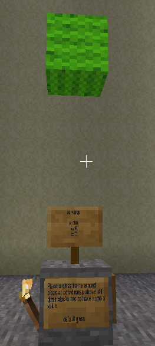

# Task 1 - Placing a block
Let's start building!

## Task
Visit the Minetest world and find your sign. It will have coordinates where you need to
create a wool block. Enter the z coordinate in the program on the left.

## Lesson
This first task teaches you how to place a block using the `build` command from `Building`.
The following line places a stone block at x=100, y=14, z=0. The `build` command saves all the blocks
in a `building`.

        b.build(100, 14, 0, "default:stone")

The `build` command has 4 parameters.
They are x, y, z, and node_type. The first 3 parameters are the coordinates where the node will be placed.
The last parameter is the name of the material to place. Examples are "default:wood", "default:dirt", "wool:blue", "default:glass", "carts:rail".
The material names are the name of the mod they come from, a colon (:), and then the material name within that mod.

Before using the `build` command you need to create a `Building` variable to store what you build. You can then use 
many `build` commands to create a complex structure. When you have finished building in Python you open a connection to the IRC chat
server (`with open_irc...`) and send the building to Minetest using the `Building.send` command. 

        b = Building()
        b.build(100, 14, 0, "default:stone")
        with open_irc(ircserver, mtuser, mtuserpass, mtbotnick, channel) as mc:
            b.send(mc)

ADVANCED: You don't need to fully understand yet why `b.send(mc)` is indented. However, it is important for `b.send` to be able to 
use the IRC connection `mc`, and then automatically close the connection afterwards.

Hints are available by clicking the light bulbs below.

Checking: Click the [Check] button below to check you have completed the task correctly.
Checking the task does not run the task so it will not build anything in the Minetest world.

Running: Click the green triangle "play" button to run your program or use keyboard (Windows/Linux = ctrl-shift-F10, Mac = ctrl-shift-r).
This will build your construction in the Minetest world. It is safer to "run" your task only after it "checks" completely. 
However, sometimes it is hard to see where the problem is from the "check". In that case, try "running" it and then in Minetest
examine what you have built to see where the problem is with your code.

When you have completed this task (Congratulations!) click the [Next] button to
move to the next task.

The sign asks for orange wool but any colour will be considered correct.

The missing number is the z coordinate where you want to place the wool.

Find the z coordinate by logging in to Minetest and finding the sign with your name on it.

© Copyright 2018-2021 Triptera Pty Ltd - https://pythonator.com - See LICENSE.txt

