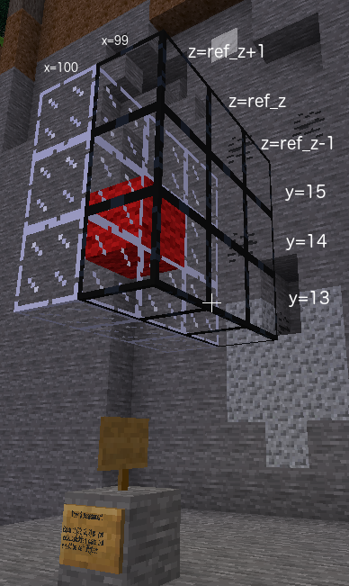

# Task 4 - Placing blocks using a `for` loop
The previous example was a lot of typing to place 9 blocks. Is there an easier way?

## Task
Place 9 obsidian glass blocks in a square at x = 99. Centre of square is
y = 14 and z = your player z value from Minetest.

## Lesson
In the previous example we needed nine `build` commands to place nine blocks.
Doing repetitive tasks is what computers are good at. If we are repeating the same task several times we tell the
computer to run in a loop until the task has been done the correct number of times. Unfortunately the task was
slightly different each time. Let's look at six of the commands in a slightly different order.

        mc.build(99, 13, ref_z - 1, glass)
        mc.build(99, 13, ref_z + 1, glass)
        mc.build(99, 14, ref_z - 1, glass)
        mc.build(99, 14, ref_z + 1, glass)
        mc.build(99, 15, ref_z - 1, glass)
        mc.build(99, 15, ref_z + 1, glass)

There are three pairs of commands which are almost the same except the y coordinate is different each time. This is where a `for`
loop can be used. We use a variable, in this case `y` which has a different value each time through the
loop. We start the loop with

    for variable_name in sequence:

The sequence is the list of values to use for that variable
each time through the loop. All the lines to be repeated in the loop are indented. The loop ends when the indentation
finishes. For example:

    for y in (13, 14, 15):
        print(y)
    print("finished")

will have the following output

    13
    14
    15
    finished

The six lines above can be replaced with three lines.

    for y in (13, 14, 15):
        mc.build(99, y, ref_z - 1, glass)
        mc.build(99, y, ref_z + 1, glass)

 

In the <code>for</code> loop you need to provide the sequence of numbers containing all the values of y

In the <code>for</code> loop you need to enclose the sequence of numbers in parentheses (), or square brackets []

In the <code>for</code> loop the required sequence is <code>(13, 14, 15)</code>

In the second build command you need to provide the name of variable which contains the y coordinate of the location to place the glass block

In the second build command you can't just type a number, because the number needs to be different each of the three times through the loop

© Copyright 2018-2021 Triptera Pty Ltd - https://pythonator.com - See LICENSE.txt
