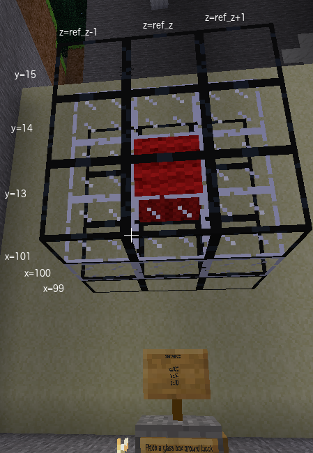

# Task 5 - Placing blocks using nested `for` loops

Nested loops are a loop within a loop.

## Task
Place a 3x3 square of obsidian glass at x = 101.
Centre of square at y = 14 and z = player z. Remember you can use formulae (e.g. ref_z - 1, ref_z, ref_z + 1) or
numbers (e.g. 19, 20, 21) in the sequence in the `for` statement.

## Lesson
If you want your program to loop with two values changing you can nest the `for`
loops. We already have a loop for y. Within the loop we can have a loop for z. Any code
in the z loop needs to be indented twice. Code in the y loop is only indented once.

        for y in (13, 14, 15):
            for z in (19, 20, 21):
                print("y", y, "z", z)

In your task.py python program on the left, there is
a `print` statement in the `z` loop. When you run the code using ctrl-shift-F10 you can see the
values of `y` and `z` each time through the loop.

In the sequence of numbers you can use numbers, variables or even formulae using the variables.
Here is an example using formulae.

        for z in (ref_z - 1, ref_z, ref_z + 1):

 

Complete the <code>for z</code> statement by providing a sequence of numbers for the different values of z.

Enclose values in parentheses () or square brackets []

Values can be numbers or variables or formulae containing variables

© Copyright 2018-2023 Triptera Pty Ltd - https://pythonator.com - See LICENSE.txt
