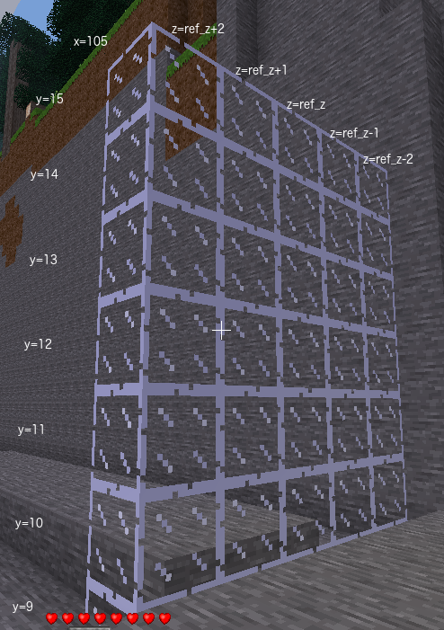

# Task 9 - Wall of glass
There are several steps to this program which is
going to build some arches over the path heading
from your signpost in the positive x direction. Each arch will
have the same profile as a cross-section of the tunnel
you have just built.

## Task
Build a solid wall of glass 7 high x 5 wide at x = 105. Glass block in the centre at the
bottom of the wall should be at y = 9, z = <em>your player z</em>.

## Lesson
The first step is to build a glass wall. This is similar to the first step in
building the tunnel which was to build a solid glass cuboid.

* The minimum x value on the path is 105 so store that in variable `path_x_min`
* The stone on the path is at level 9 so store that in variable `floor_y`
* The arch will have same dimensions as tunnel, 7 high and 5 wide, so store in `arch_height` and `arch_width`

We need to calculate the z position of the sides of the arch. We know the z position
of the centre of the arch, and we know the width of the arch. Hence, the formula is

    wall_z = ref_z - arch_width // 2

We are going to store the x values of the arches in variable `range_x_arch`. For testing, we
will start with one x value. Let us use the start of the path which is `path_x_min`.

    range_x_arch = path_x_min

Store the external dimensions of the arch in `range_y_ext` and `range_z_ext`.

    range_y_ext = range(floor_y, floor_y + arch_height)
    range_z_ext = range(wall_z, wall_z + arch_width)

Remember that the `range()` function returns a sequence of numbers. For
our purposes the formula above for `range_y_ext` is equivalent to typing:

    range_y_ext = [9, 10, 11, 12, 13, 14, 15]

 

Set path_x_min to the x value where path starts. See image above to find value of x

Set floor_y to the y level of stone on path. See lowest value of y in image above

wall_z can be calculated by a formula in terms of ref_z and arch_width

wall_z is the centre of the wall (ref_z) - half of arch width rounded down (arch_width // 2)

x location of first arch

range_y_ext is a formula (in terms of floor_y and arch_height) or numbers for all y values in arch (external dimensions)

range_z_ext is a formula (in terms of wall_z and arch_width) or numbers for all z values in arch (external dimensions)

© Copyright 2018-2023 Triptera Pty Ltd - https://pythonator.com - See LICENSE.txt
