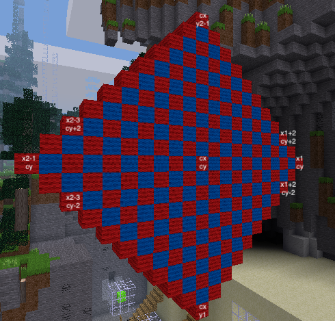

# Task 7 - Chequered diamond

Have you tried the Minetest in-game quiz? In Minetest, type

        \quiz

Then go down the tunnel where you found Task 4 and look for a side tunnel.

Task 7 is on your sign in the Minetest world and is a more challenging variation on the chequered square.

Complete this task or 5 questions in the quiz and you will get the 'fast' privilege.

## Task

Construct a vertical diamond shape of alternating wool colours in the sky with a width and
height of 21 blocks. All blocks to have the same `z` value.

## Lesson

Most of the code is similar to the chequered square. This challenge is to come up with formulae for xlo and yhi,
the low and high values of x where you want to place blocks on each row. And remember, the hints can be your friend.

 

Choose any two colours from white, grey, dark_grey, black, blue, cyan, green, dark_green, yellow, orange, brown, red, pink, magenta, violet

Width and height of diamond is measured in blocks

<code>xlo</code> is the starting value of <code>x</code> for each value of <code>y</code>

Formula for <code>xlo</code> can be written in terms of <code>x1</code>, <code>y</code>, <code>cy</code>

If you can't create a single formula, try writing two formulae on paper first. One for y &le; cy and one for y &gt; cy. 

It is possible to combine the two formulae for xlo into one using the abs() function which returns the absolute value of a number. The absolute value of negative numbers is the same number but made positive. The absolute value of positive numbers is the same number.
<pre><code>    abs(5) = 5
    abs(-3) = 3</code></pre>

<code>xhi</code> is the maximum value of <code>x</code> in the diamond for a given <code>y</code> value

Formula for <code>xhi</code> can be written in terms of <code>x2</code>, <code>y</code>, <code>cy</code>

 
