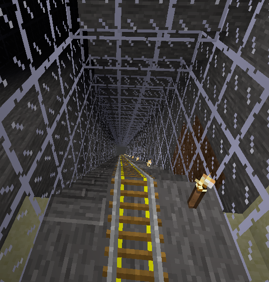
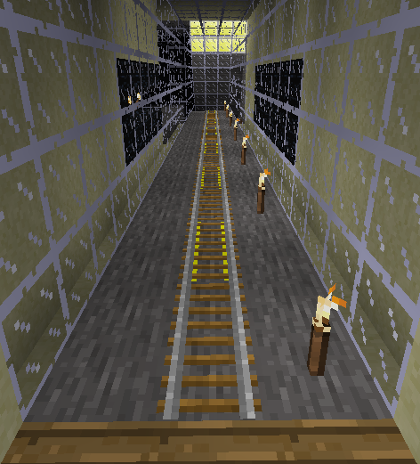

# Task 9 - Stairs and rail

Look in the chest at the bottom of the task 8 tunnel to find instructions for task 9.

## Task

Put rail and powered rail along centre of your tunnel.
Where the tunnel is sloping, place stairs down the left side.
Where the tunnel is flat we don't need so much power
rail. Use two pieces of rail followed by two pieces of
power rail, and keep alternating two at a time.

## Lesson

This task introduces some new materials. Every material has a name. The name is of
type `str` (string) which is made up of

        "mod_name:material_name_in_mod"

For example, `"default:stone"` is from the `"default"` mod and has a material name in that mod of `"stone"`.
Similarly, `"wool:red"` is from the `"wool"` mod and has a material name in that mod of `"red"`.

For this task we will use two materials from the `"carts"` mod.

We will also use a material from the `"stairs"` mod, `"stair_stonebrick"`. When we build with stairs
we need to specify the material and the direction the stairs will be facing. To specify extra
information we use a `dict` (dictionary) rather than a `str` (string). `dict`s are defined using several
key: value pairs. The keys to use for stairs in this task are `"name"` and `"direction"`.
For example

    {"name": "stairs:stair_stonebrick", "direction": "-z"}

The possible values of `"direction"` are

        "+z"  # z direction upward;
        "+x"  # x direction upward;
        "-z"  # z direction downward;
        "-x"  # x direction downward;

The first image shows the stairs and rail on the
sloping section of the tunnel.

The second image shows the flat part of the tunnel
with rail and power rail each in pairs

This task expects `stair_up_x` to be defined using keys `"name"` and `"direction"` .
However, you can also use the Minetest
Lua equivalent `"name"` and `"param2"`.

        {"name": "stairs:stair_stonebrick", "param2": "2"}

The possible values of `"param2"` are:

        "param2": "0"  # same as "direction": "+z"
        "param2": "1"  # same as "direction": "+x"
        "param2": "2"  # same as "direction": "-z"
        "param2": "3"  # same as "direction": "-x"

You can even use a JSON string rather than a Python `dict`.

    '{"name": "stairs:stair_stonebrick", "direction": "-z"}'

 

See task sign in minetest for item names you will need in this task

<code>stair_up_x</code> needs a <code>dict</code> specifying stonebrick stairs sloping down towards negative x

<code>rail</code> needs a <code>str</code> item name for rail from the carts mod

<code>power_rail</code> needs a <code>str</code> item name for power rail from the carts mod

When placing rail and power rail in the flat section of the tunnel, <code>if</code>
needs a formula in terms of x which will alternate every two blocks. For example:
<pre><code>    0 0 1 1 0 0 1 1 0 0 1 1 ...</code></pre>

The modulo epxression j % 2 will alternate every one block
<pre><code>    0 1 0 1 0 1 0 1 ...</code></pre>
So replace j with something in terms of x which counts at half speed

x // 2 counts at half speed
<pre><code>    0 0 1 1 2 2 3 3 4 4 ...</code></pre>

x // 2 % 2 combines the two to get the alternating pattern

0 0 1 1 0 0 1 1 ...

 
