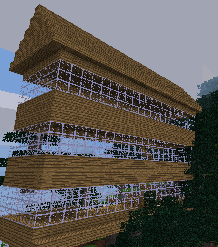
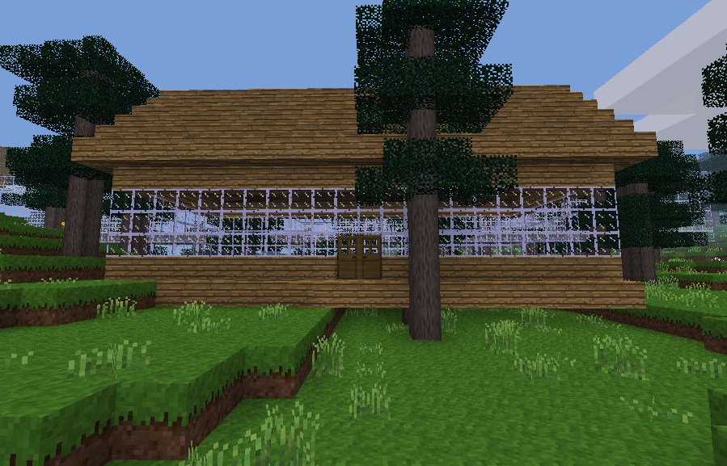

# Railway station

We have all the helper functions to build
complex structures quickly saved in the minetest_helper.py
module. Now we can start building them. The first 
structure will be a railway station.

This task also teaches string slicing, a useful tool to split up a string of text.

## Task

Define a function which will build a railway station. The user of this
function will be able
to change the appearance by setting arguments to the function
such as:

* location
* length of platform
* size of waiting room
* building materials
* number of storeys (levels)

Make life easier for the user by providing defaults
for arguments which are not set explicitly. This means the user
only has to provide specifications which are different to the 
defaults. The only data which needs to be provided is the 
location of the station. The function needs to return a `dict`
of all the built node data before it is
sent to Minetest.

## Lesson

Try to follow through the function to see how the different
parts of the station are built. There are comments before each
section because it is not obvious from reading `build()`
and `build_cuboid()` commands
what is being achieved at each step.

Once we are finished developing this function we will add
it to minetest_helper.py module so it can be called from other 
functions.

### Three level station

### One level station

 

See function documentation (between """ and """ just after function definition) for default value of room height 

Default room height is specified in function documentation on line 18

formula in terms of door which returns the value of door without the last two characters

Use the slicing notation to get a slice of a string. Test the following in Python console.

<code>a = 'abcdefg'</code>

<code>a[2:5]  #  'cde'</code>

<code>a[:5]  #  'abcde'</code>

<code>a[:-1]  # 'abcdef'</code>

First number is the start point (inclusive, defaults to 0 if omitted). 
Second number is the end point (exclusive). If second number is negative it counts back from the end.

To calculate the roof <code>layer_width</code> use a formula in terms of station_width and roof_layer which returns the width of the roof at that layer

When calculating <code>layer_width</code> the bottom layer is <code>roof_layer = 0</code> and it increases by one each layer up it goes

The formula for <code>layer_width</code> is the same as the <code>layer_width</code> formula used earlier in the code

 
