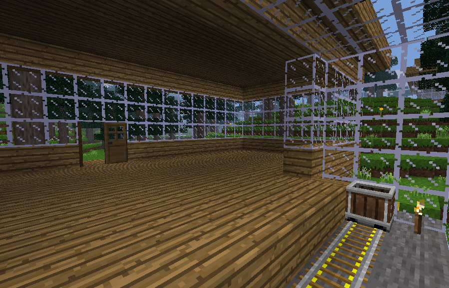
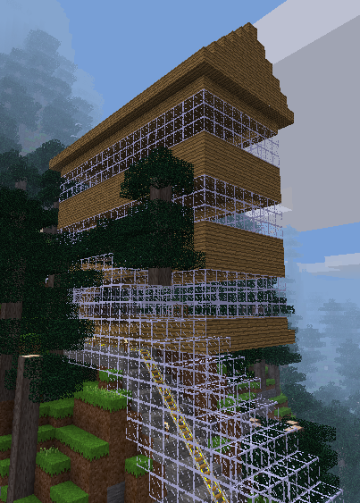

<html>
<h1>Tunnel with stations</h1>

This task puts together everything we have learnt in this
course. Our tunnel code from the first lesson is put into 
a function. It also calls the build_station_dirx function to 
put a station at either end. See if you can solve the four
challenges in the code and then you will have a functional 
tunnel builder. After this you can start creating your own 
functions to build structures in minetest. Thanks for 
completing the course.

HAVE FUN!!

</html>
 

Set the values of xmin, y_at_xmin, xmax, y_at_xmax when x2 > x1

Use x1, x2, y1, y2

Formula in terms of tunnel_y and y_at_xmin which checks that we are not building the tunnel floor higher than  ground level at xmin.

Please provide 3 arguments to this function

Make sure you pass on room size and materials that were in function build_tunnel_dirx arguments

Please provide 3 arguments

 
